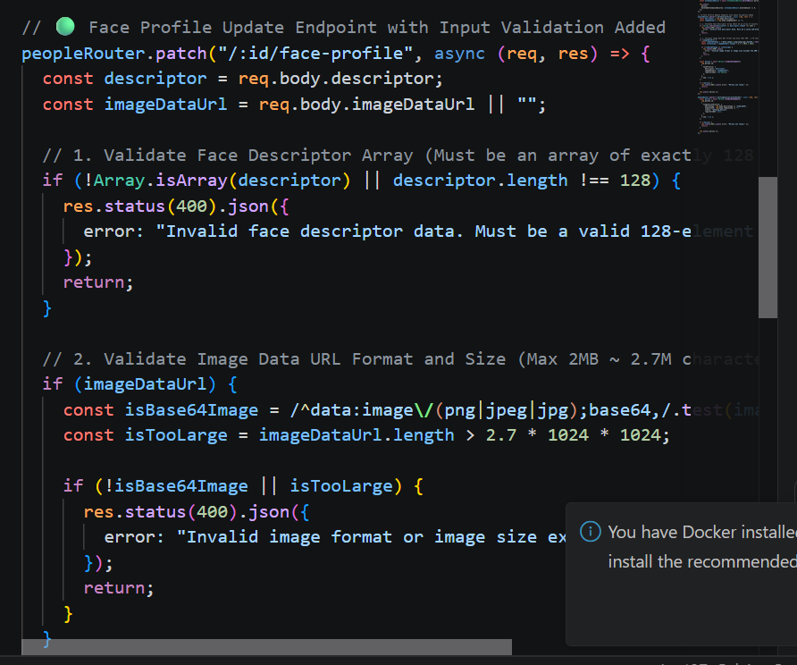

# Face Recognition Attendance System — Security Assessment & Hardening

Security assessment and hardening of a face recognition-based attendance system built with **Flask, Node.js/Express, React, and MongoDB**. This assessment was conducted on a production system used internally by **ProJenius Innovation Technology Pvt. Ltd.** as part of a Cyber Security Internship engagement.

The assessment identified and remediated **10 application security vulnerabilities** across authentication, session management, input validation, database security, API security, and application configuration.

---

## What Makes This Different

Most student security write-ups stop at "found X vulnerabilities." This one goes a step further:

- **Real production codebase** — not a deliberately vulnerable practice app (DVWA, Juice Shop, etc.), but an actual internal company system with real users and real data.
- **Dual-backend hardening** — Flask and Node.js/Express don't share a security model, so each vulnerability class had to be diagnosed and fixed in its own stack, doubling the surface area covered.
- **Before/after proof for every fix** — each vulnerability includes a screenshot of the exploit condition and a screenshot of the patched behavior, not just a code diff.
- **Load-tested, not just code-reviewed** — the rate-limiting and timing-attack fixes were verified under load (autocannon) rather than assumed correct from the code alone.

---

## Tech Stack

- **Backend:** Flask (Python), Node.js / Express.js
- **Frontend:** React
- **Database:** MongoDB
- **Security Tooling:** Helmet.js, express-rate-limit, Winston

---

## Vulnerability Summary

| # | Vulnerability | Impact | Remediation |
|---|---|---|---|
| 1 | Cross-Tab Session Desynchronization | Other tabs could remain authenticated after logout | Added browser storage event synchronization |
| 2 | Information Disclosure | Default `admin` username exposed unnecessary information | Removed hardcoded username |
| 3 | Missing Login Rate Limiting | Unlimited attempts enabled brute-force attacks | 5 failed attempts → 15-minute IP lockout |
| 4 | Timing Attack | Standard comparison could expose timing information | Implemented constant-time comparison |
| 5 | Face Descriptor Input Validation | Malformed or oversized biometric data could reach processing layers | Validated 128-value descriptors and limited payload size |
| 6 | Missing Security Logs / Audit Trail | Security events were difficult to monitor and investigate | Added structured logging with Winston |
| 7 | ObjectId / NoSQL Injection Risk | Invalid IDs could cause errors and expose internal details | Added ObjectId validation and error handling |
| 8 | Exposed Flask Debug Mode | Debug configuration could expose sensitive application information | Enforced `debug=False` by default |
| 9 | Missing Express Security Headers | Responses lacked defensive HTTP security headers | Added Helmet.js middleware |
| 10 | Excessive Request Body Limit | Large payloads could contribute to memory-exhaustion DoS | Reduced request limit from 10MB to 1MB |

---

# 1. Cross-Tab Session Desynchronization

**The Flaw:** One browser tab had no way of knowing that logout occurred in another tab. A previously opened tab could continue displaying application content.

**The Fix:** Implemented a `storage` event listener. When logout occurs, a `logout-event` is written to `localStorage`. Other open tabs detect the change, clear the session state, and redirect to the login page.

### Mitigation

### Patching

---

# 2. Information Disclosure

**The Flaw:** The login form automatically displayed the default `admin` username, providing unnecessary information to an attacker.

**The Fix:** Removed the hardcoded username so users must provide both username and password.

### Mitigation

### Patching

---

# 3. Missing Rate Limiting on Login

**The Flaw:** The login endpoint accepted unlimited password attempts from a single IP, enabling automated brute-force attempts.

**The Fix:** Added `express-rate-limit`. After **5 failed attempts**, the IP address is temporarily blocked for **15 minutes**.

### Mitigation

### Patching

---

# 4. Timing Attack

**The Flaw:** Standard `==` / `===` comparisons can produce timing differences based on where a mismatch occurs.

**The Fix:** Replaced standard comparisons with a constant-time comparison using `crypto.timingSafeEqual`.

### Mitigation

### Patching — Wrong Password

### Patching — Correct Password

---

# 5. Face Descriptor Input Validation

**The Flaw:** The biometric submission endpoints accepted data without sufficient validation of structure and size.

**The Fix:** Enforced validation requiring the face descriptor to contain exactly **128 floating-point values** and restricted the request payload to **2MB**.

### Mitigation — People.js

### Mitigation — Attendance.js

### Patching

---

# 6. Missing Security Logs / Audit Trail

**The Flaw:** Important authentication, API, and system events were not sufficiently recorded, making security investigation difficult.

**The Fix:** Added structured logging using **Winston**, separating general events and errors into `combined.log` and `error.log`.

### Mitigation

### Patching — combined.log

### Patching — error.log

---

# 7. ObjectId / NoSQL Injection Risk

**The Flaw:** Incoming document IDs were passed into MongoDB operations without sufficient validation. Invalid IDs could cause server errors and expose internal details.

**The Fix:** Added ObjectId format validation and exception handling. Invalid IDs now return a controlled `400 Bad Request` response.

### Mitigation

### Patching

---

# 8. Exposed Flask Debug Mode

**The Flaw:** Debug configuration could expose sensitive application information when incorrectly enabled in a production environment.

**The Fix:** Configured `debug=False` as the default, with debug mode enabled only when explicitly required for development.

### Mitigation

### Patching

---

# 9. Missing Express Security Headers

**The Flaw:** The Express backend lacked defensive HTTP security headers, increasing exposure to browser-based attacks such as clickjacking and MIME sniffing.

**The Fix:** Added **Helmet.js** middleware globally to provide defensive HTTP security headers.

### Mitigation

### Patching

---

# 10. Excessive Request Body Limit

**The Flaw:** The JSON body parser accepted requests up to **10MB**, creating unnecessary exposure to resource-exhaustion attacks.

**The Fix:** Reduced the request body limit to **1MB**. Oversized requests are rejected with `413 Payload Too Large`.

### Mitigation

### Patching

---

# Results

- **10/10 vulnerabilities identified and remediated**
- Hardened authentication and session management
- Added input validation and API protections
- Improved MongoDB security and error handling
- Added structured security logging
- Added defensive HTTP security headers
- Reduced excessive request payload limits
- Verified remediation through manual testing and targeted testing of security controls

---

## Security Areas Demonstrated

**Application Security • Vulnerability Assessment • Secure Coding • Authentication Security • API Security • Input Validation • Database Security • Security Logging • Web Security • Defensive Security**

---

## Disclaimer

This project was conducted on a system built and controlled by the author for educational and defensive security purposes. No unauthorized testing was performed.
