# Attendance System — Security Vulnerability Assessment & Remediation

Security assessment and hardening of a face recognition based attendance system built with a **Flask**, **Node.js/Express**, and **MongoDB** stack. Identified and remediated **10 application security vulnerabilities** spanning authentication, session management, input validation, database security, and API security.

---

## Table of Contents

- [Tech Stack](#tech-stack)
- [Vulnerability Summary](#vulnerability-summary)
- [1. Cross-Tab Session Desynchronization](#1-cross-tab-session-desynchronization)
- [2. Information Disclosure](#2-information-disclosure)
- [3. Missing Rate Limiting on Login](#3-missing-rate-limiting-on-login)
- [4. Timing Attack](#4-timing-attack)
- [5. No Input Validation on Face Descriptor Data](#5-no-input-validation-on-face-descriptor-data)
- [6. Missing Security Logs / Audit Trail](#6-missing-security-logs--audit-trail)
- [7. ObjectId / NoSQL Injection Risk](#7-objectid--nosql-injection-risk)
- [8. Exposed Flask Debug Mode](#8-exposed-flask-debug-mode)
- [9. Missing Express Security Headers](#9-missing-express-security-headers)
- [10. Excessive Request Body Limit](#10-excessive-request-body-limit)
- [Results](#results)
- [Disclaimer](#disclaimer)

---

## Tech Stack

- **Backend:** Flask (Python), Node.js / Express.js
- **Database:** MongoDB
- **Frontend:** React
- **Security Tooling:** Helmet.js, express-rate-limit, Winston (logging)

---

## Vulnerability Summary

| S. No.| Vulnerability | Impact | Fix |
|---|---|---|---|
| 1 | Cross-Tab Session Desynchronization | Logging out on one tab left other open tabs still authenticated, exposing data on unattended screens | Browser storage event listener syncs logout across all open tabs instantly |
| 2 | Information Disclosure (default username) | Login page auto-filled `admin`, halving the brute-force search space for attackers | Removed hardcoded username; both username and password must be entered manually |
| 3 | Missing Rate Limiting on Login | Unlimited password attempts allowed automated brute-force attacks | IP-based rate limiting — 5 failed attempts triggers a 15-minute lockout |
| 4 | Timing Attack | Standard `==` string comparison leaked timing information, letting an attacker infer correct characters from response delay | Replaced with constant-time comparison (`crypto.timingSafeEqual`) |
| 5 | No Input Validation on Face Descriptor Data | Malformed or oversized biometric payloads could crash the matching engine or exhaust disk space | Strict schema validation — payloads must be exactly 128 floating-point values, capped at 2MB |
| 6 | Missing Security Logs / Audit Trail | No record of logins, API access, or admin actions, making incident investigation impossible | Structured logging via Winston — `combined.log` for all events, `error.log` for failures |
| 7 | ObjectId / NoSQL Injection Risk | Malformed IDs passed directly to MongoDB caused server crashes and leaked internal stack traces | ID format validated before query execution; invalid IDs return a clean `400 Bad Request` |
| 8 | Exposed Flask Debug Mode | Debug mode enabled in production exposes an interactive Python console to attackers | `debug=False` hardcoded by default, only enabled via explicit `FLASK_ENV` flag |
| 9 | Missing Express Security Headers | No defensive HTTP headers, leaving the app open to clickjacking and MIME-sniffing | Helmet.js middleware adds 15 defensive HTTP security headers globally |
| 10 | Excessive Request Body Limit | 10MB JSON payload limit allowed memory-exhaustion DoS attacks | Body size capped at 1MB; oversized requests rejected with `413 Payload Too Large` |

---

## 1. Cross-Tab Session Desynchronization

**The Flaw:** One browser tab had no way of knowing a logout happened in another tab. A previously opened tab could keep displaying private data after the user believed they'd logged out.

**The Fix:** Implemented a `storage` event listener. On logout, a `logout-event` key is written to `localStorage`; every other open tab detects the change, clears its session state, and redirects to the login page.

## Mitigation 

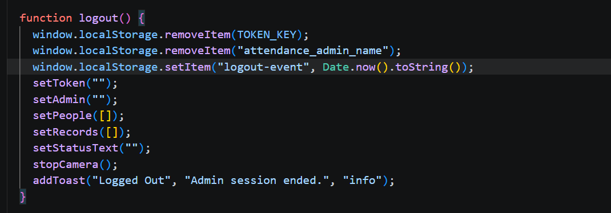
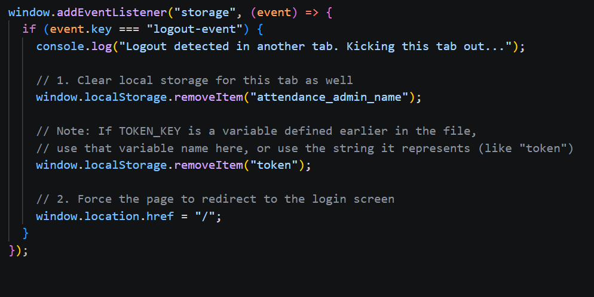

## Patching

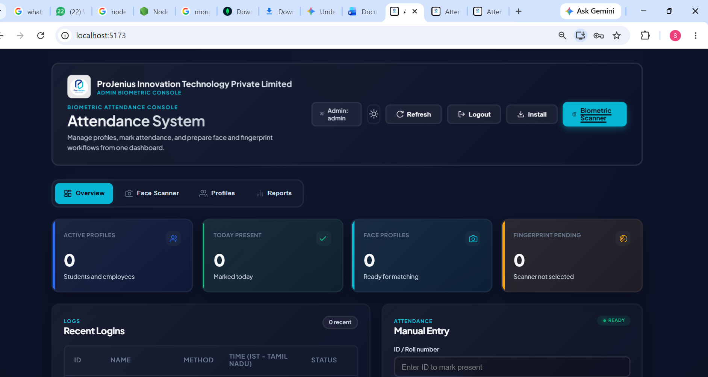
---

## 2. Information Disclosure

**The Flaw:** The login form auto-populated the `admin` username, cutting the credential-guessing effort for an attacker in half.

**The Fix:** Removed the hardcoded username. Both username and password fields are now blank by default, requiring full credentials to be entered manually.

## Mitigation 

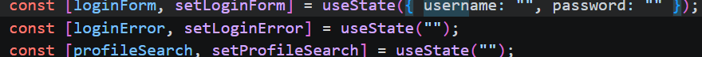

## Patching 

---

## 3. Missing Rate Limiting on Login

**The Flaw:** The login endpoint accepted unlimited password attempts from a single IP, enabling automated brute-force attacks.

**The Fix:** Added `express-rate-limit` middleware — 5 failed login attempts from an IP trigger a 15-minute lockout, with a clear error response.

## Mitigation

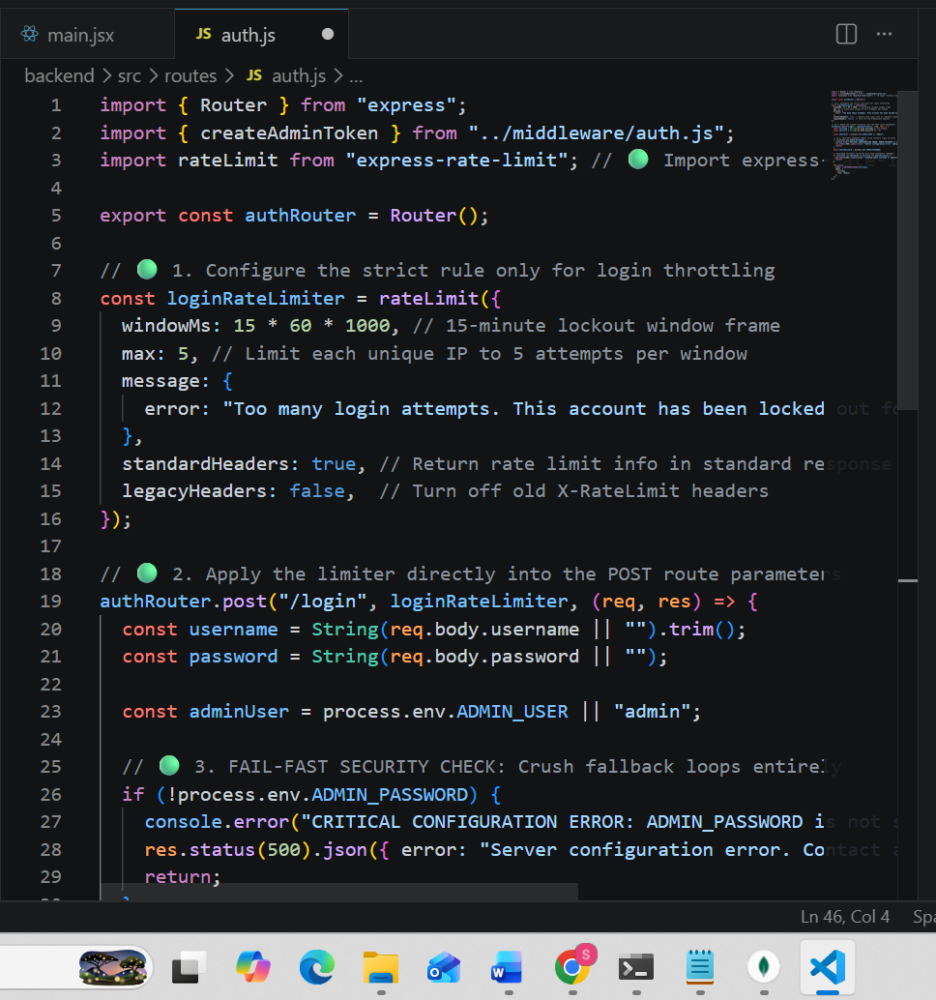

## Patching 

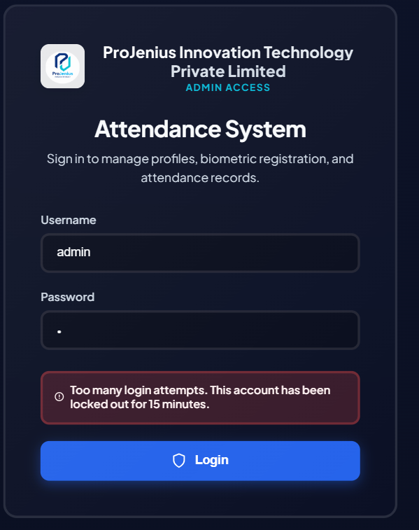

---

## 4. Timing Attack

**The Flaw:** Standard `==`/`===` string comparisons stop at the first mismatched character, creating measurable response-time differences an attacker could exploit to guess credentials character by character.

**The Fix:** Replaced standard comparisons with a constant-time comparison (`crypto.timingSafeEqual` over hashed values) so response time is identical regardless of where a mismatch occurs.

## Mitigation 

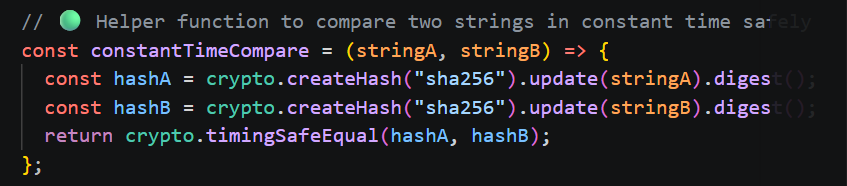

## Patching

## Wrong password 

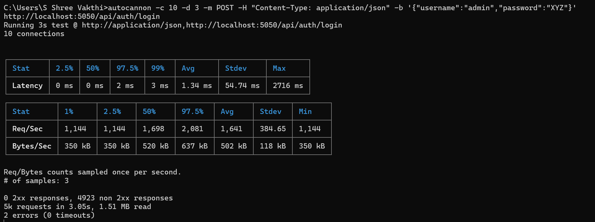

## Correct password 

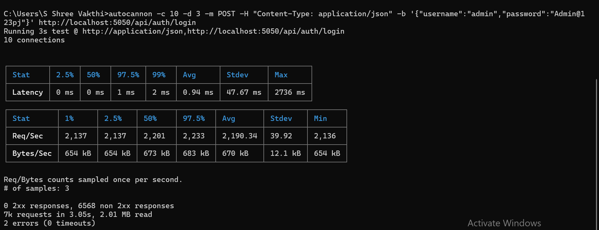

---

## 5. No Input Validation on Face Descriptor Data

**The Flaw:** Biometric submission endpoints accepted any payload shape or size, risking crashes or database bloat from malformed or oversized uploads.

**The Fix:** Enforced strict validation — the face descriptor must be an array of exactly 128 floating-point values, and the total payload is capped at 2MB.

## Mitigation 

## People.js

## Attendance.js

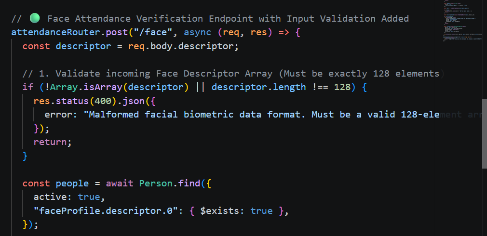

## Patching 

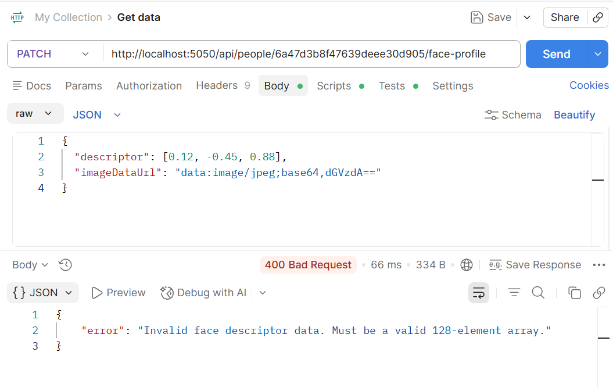
---

## 6. Missing Security Logs / Audit Trail

**The Flaw:** No logging existed for authentication attempts, API access, or admin actions, making it impossible to detect or investigate incidents.

**The Fix:** Added structured logging with Winston, splitting output into `combined.log` (all events) and `error.log` (failures and crashes only).

## Mitigation

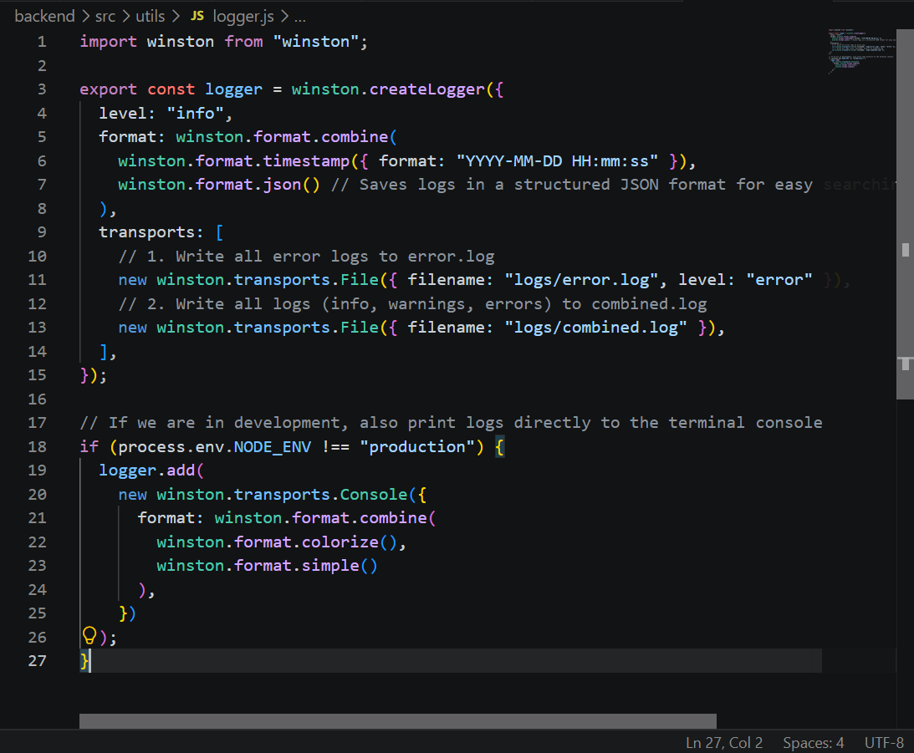

## Patching 

## combined.log

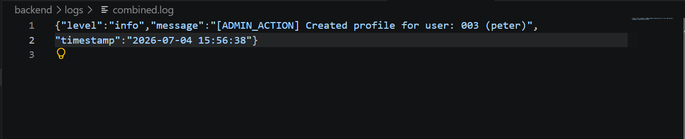

## Error.log

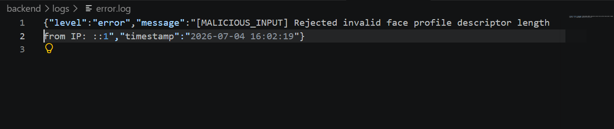

---

## 7. ObjectId / NoSQL Injection Risk

**The Flaw:** Incoming document IDs were passed directly into MongoDB lookups without validation. Malformed IDs crashed the request and leaked raw Python stack traces to the client.

**The Fix:** Added ID format validation (must be a 24-character hex string) with proper exception handling — invalid IDs now return a clean `400 Bad Request`.

## Mitigation 

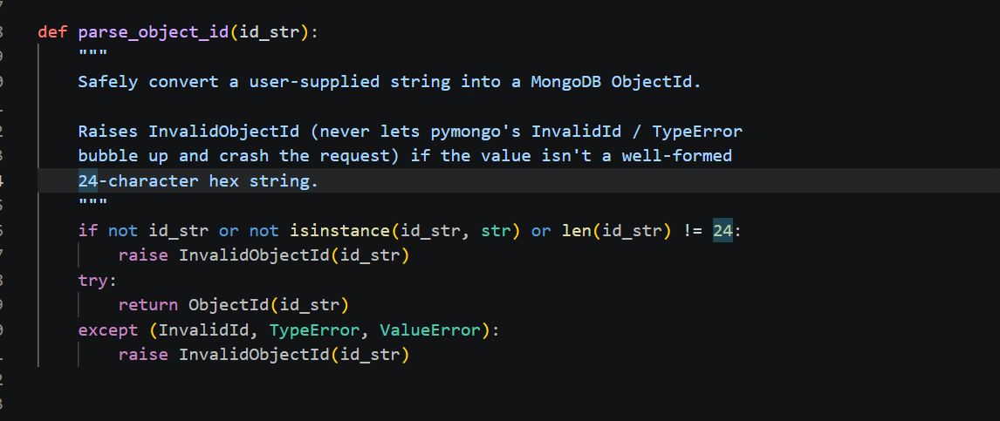

## Patching 

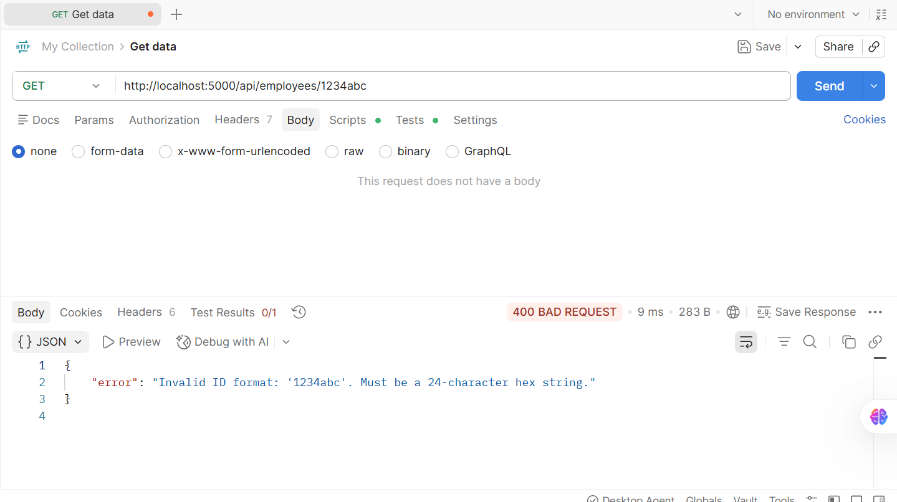

---

## 8. Exposed Flask Debug Mode

**The Flaw:** Debug mode was controlled by a loose environment variable. If left enabled in production, runtime errors would expose an interactive Python console in the browser.

**The Fix:** Hardcoded `debug=False` as the default; debug mode only activates when `FLASK_ENV` is explicitly set to `development`.

## Mitigation 

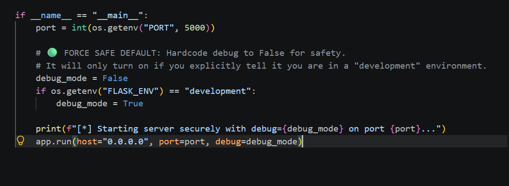

## Patching 

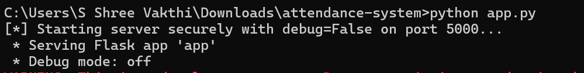

---

## 9. Missing Express Security Headers

**The Flaw:** The Express backend sent responses without defensive HTTP headers, leaving the app exposed to clickjacking and MIME-type sniffing attacks.

**The Fix:** Added Helmet.js middleware globally, injecting 15 defensive HTTP security headers into every response.

## Mitigation 

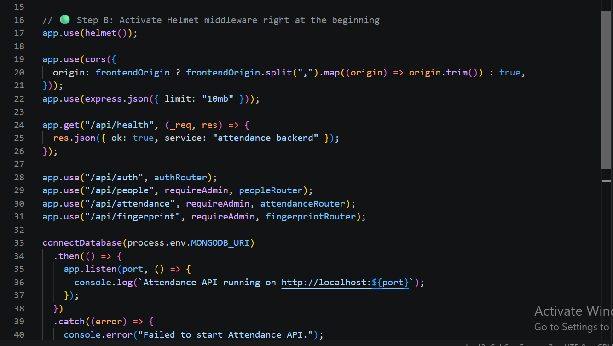

## Patching 

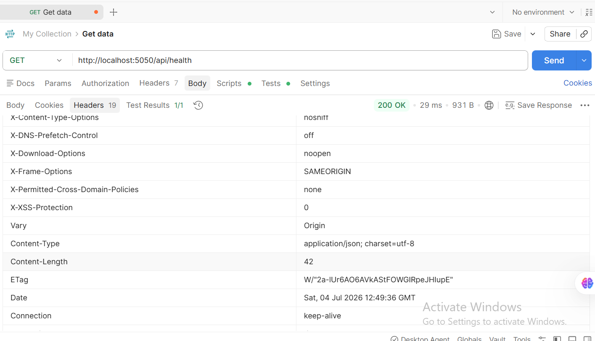

---

## 10. Excessive Request Body Limit

**The Flaw:** The JSON body parser accepted payloads up to 10MB, allowing attackers to flood the server with oversized requests and trigger memory exhaustion.

**The Fix:** Reduced the body size limit to 1MB. Oversized requests are now rejected instantly with a `413 Payload Too Large` response.

## Mitigation

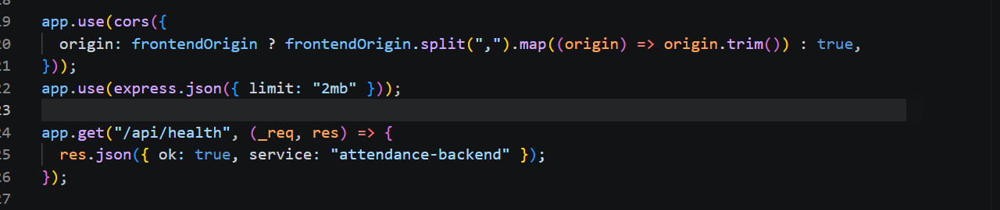

## Patching  

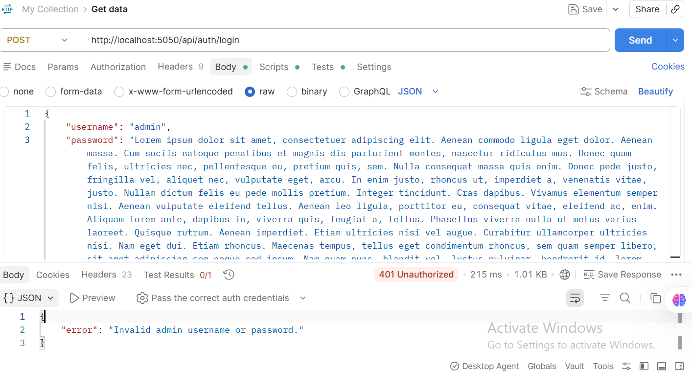

---

## Results

- **10/10** identified vulnerabilities remediated
- Session, authentication, input validation, database, logging, and API layers hardened
- Verified via manual testing and load testing (autocannon) for rate limiting and timing behavior

---

## Disclaimer

This project was conducted on a system built and controlled by the author for educational and defensive security purposes. No unauthorized testing was performed.
